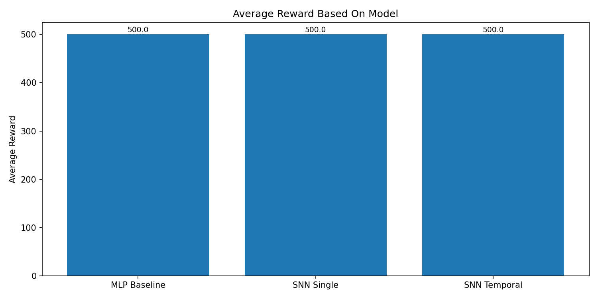
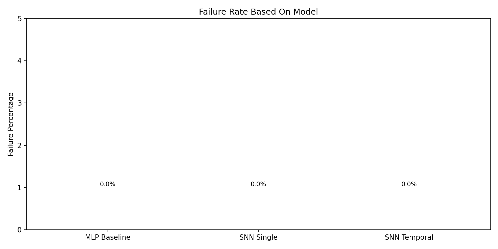

# CartPole-SNN: Comparing MLP and Spiking Controllers on CartPole

This project trains and compares three controllers to attempt to control the cartpole simulation:

- A **standard MLP baseline** (ANN)
- A **single-step SNN** (direct analog input -> LIF -> action)
- A **temporal SNN** (multi-step LIF dynamics with repeated analog input)

All learned controllers are trained via **offline imitation learning** from a heuristic policy and then evaluated directly in the CartPole environment.

---

## Project Overview

**Primary Goal:**  
Use the CartPole environment as a small control testbed to compare a conventional MLP controller against spiking neural network (SNN) controllers, and see whether SNNs can match performance on a simple control task.

**Key Tasks:**

- Collect a large dataset of state–action pairs from a strong **heuristic controller**.
- Train three different neural controllers (MLP, SNN single-step, SNN temporal) to **imitate** the heuristic.
- Evaluate each controller in the actual CartPole environment and compare:
  - Average reward / episode
  - Failure rate (episodes that end before the max timestep)
  - Qualitative behavior (e.g., smoothness of control)

---

## Repository Structure

```text
cartpole-SNN/
├── models/
│   ├── MLP_baseline.py         # MLP controller
│   ├── SNN_single.py           # single-step SNN controller
│   └── SNN_temporal.py         # temporal SNN controller
│
├── training_scripts/
│   ├── trajectory_collection.py# collect heuristic trajectories
│   ├── train_MLP_baseline.py   # train MLP controller
│   ├── train_SNN_single.py     # train single-step SNN controller
│   └── train_SNN_temporal.py   # train temporal SNN controller
│
├── result_scripts/
│   ├── evaluate_MLP_baseline.py    # evaluate MLP baseline
│   ├── evaluate_SNN_single.py      # evaluate single-step SNN
│   ├── evaluate_SNN_temporal.py    # evaluate temporal SNN
│   └── simulation_results.py   # load eval JSONs and plot comparison graphs
│
├── raw_data/
│   ├── mlp_baseline_cartpole.pt # trained mlp controller for evaluation script
│   ├── snn_single_step_cartpole.pt # trained single step snn controller for evaluation script
│   ├── snn_temporal_cartpole.pt # trained temporal snn controller for evaluation script
│   └── cartpole_trajectories.pt # offline dataset of (state, action) pairs
│
├── results/
│   ├── eval_*.json             # saved evaluation metrics for specified model
│   ├── *_training_curves.json  # saved training curves for specified model
│   ├── cartpole_avg_rewards_graph.png # bar chart: average reward per controller
│   └── cartpole_fail_rate_graph.png # bar chart: failure rate per controller
│
├── environment_test.py         # quick program to ensure environment works
├── env_utilities.py         # script to help simulate environment
├── requirements.txt            # Python dependencies
└── README.md
```

---

## Setup
Install needed requirements by running the command in repo root:
```
pip install -r requirements.txt
```

**This project was performed in a conda virtual environment on python 3.11**

---

## Operating Sequence

**All run commands assume you are in the repository root and you are in the appropriate environment.**

### Small Environment Check
```
python -m environment_test
```
This is optional, but reccomended to ensure the environment functions without errors.

### Collect Trajectories
```
python -m training_scripts.trajectory_collection
```
This is the first program that must be run before training.
It will run a heuristic controller for a fixed number of episodes and save a large dataset of trajectories the models will train on.

### Train Controllers On Datasets
**To train the MLP baseline:**
```
python -m training_scripts.train_MLP_baseline
```

**To train the single step SNN:**
```
python -m training_scripts.train_SNN_single
```

**To train the temporal SNN:**
```
python -m training_scripts.train_SNN_temporal
```

These scripts will train models based on the previously collected data, and saves the trained models to the appropriate folder to be used in evaluation.

### Run Simulation

**To run the baseline MLP simulation:**
```
python -m result_scripts.evaluate_MLP_base
```

**To run the single step SNN simulation:**
```
python -m result_scripts.evaluate_SNN_single
```

**To run the temporal SNN simulation:**
```
python -m result_scripts.evaluate_SNN_temporal
```

These scripts will take the saved trained models and put them in a simulation, measuring their effectiveness. A simulation video will appear to visualize the behavior of the models as they balance the pole.

### Result Plotting

**If you wish to visualize your results, run:**
```
python -m result_scripts.simulation_results
```

The graphs will be sent to the results folder under *cartpole_avg_rewards_graph* and *cartpole_fail_rate_graph*

---

## Model Explanation

### Heuristic Controller
A relatively simple and effective controller, using a simple and effective equation to balance the pole:
```text
x, x_dot, theta, theta_dot = obs
    force = 1.0 * theta + 0.1 * theta_dot + 0.01 * x + 0.1 * x_dot
    return 1 if force > 0 else 0
```
It collects various data based on the position of the pole, such as speed and angle, and corrects accordingly. This controller is used to generate the offline dataset the models are trained on.

### MLP Baseline
A standard RELU network that takes the same positional inputs as the heuristic controller. Unlike the heuristic, it must learn how to balance the pole.

### Single Step SNN
A single step LIF network that has a relatively similar network architecture to the MLP baseline, except using leaky integrate and fire neurons instead of RELU ones. Due to being single step, it has no time dimension and trains almost exactly like the MLP baseline.

### Temporal SNN
A model that has a slightly more complex design than previous models, due to including a time dimension. Like the single step SNN, it uses leaky integrate and fire neurons. For each decision, the internal state is normalized and analyzed for the specified num_steps. This makes training and the simulation run slower than the other models.

---

## Result Documentation

### Reward And Failure Rate
After training the models and evaluating data, all three controllers achieved effectively perfect performance for the specified steps per episode of 500, with a 0% failure rate.




Both graphs show how all compared models have identical end results.

**Notable behavior/data:**
The dataset size for all models is 250,000. With 200,000 training transition and 50,000 validation transistions.
The temporal SNN struggled initially to rise above a 75% accuracy using noisy spike encodings, even after training for multiple epochs. Switching to *deterministic repeated analog encoding* fixed this issue immediately, bringing it in line with the other models.

---

## Project Analysis

- SNNs can match standard ANNs on simple control tasks when trained via offline learning.
- The single step SNN expectedly behaves very similarily to the ANN, with a near equal training time and effectively identical evaluation results.
- The temporal SNN needs to use more computing power per decision due to an increase in time spent on that decision, but the simulation produces extremely smooth end behavior, to the point where the pole seems like it is at a standstill. This demonstrates how spiking networks can still solve a reactive control task.

---

## Practical Learning Takeaways

- Experience building SNN controllers with PyTorch and SNNTorch
- Direct experience how different spike encoding/spiking methods may effect training, positively or negatively.
- Experience building an offline supervised training network to control something in an environment

---

## Potential Future Work For Project

- Use an online learning method such as policy gradient instead of imitation learning.
- Train the SNN on noisy spike encodings to test performance.
- Explore different spike encoding tactics.
- Compare energy and computational costs between the models.

---

## License

This project is licensed under the terms of the **MIT License**.  
See the [`LICENSE`](./LICENSE) file for details.
